# Project-HTU
Predicting the Age of Abalone from Physical Measurements
# Abalone Age Prediction

Import The libraries 


```python
import pandas as pd
import numpy as np
import matplotlib.pyplot as plt
import seaborn as sns 
```

Get The Data 


```python
df = pd.read_csv('abalone.data.csv')
df.head()
```


<div>
<style scoped>
    .dataframe tbody tr th:only-of-type {
        vertical-align: middle;
    }

    .dataframe tbody tr th {
        vertical-align: top;
    }

    .dataframe thead th {
        text-align: right;
    }
</style>
<table border="1" class="dataframe">
  <thead>
    <tr style="text-align: right;">
      <th></th>
      <th>Sex</th>
      <th>Length</th>
      <th>Diameter</th>
      <th>Height</th>
      <th>Whole weight</th>
      <th>Shucked weight</th>
      <th>Viscera weight</th>
      <th>Shell weight</th>
      <th>Rings</th>
    </tr>
  </thead>
  <tbody>
    <tr>
      <th>0</th>
      <td>M</td>
      <td>0.455</td>
      <td>0.365</td>
      <td>0.095</td>
      <td>0.5140</td>
      <td>0.2245</td>
      <td>0.1010</td>
      <td>0.150</td>
      <td>15</td>
    </tr>
    <tr>
      <th>1</th>
      <td>M</td>
      <td>0.350</td>
      <td>0.265</td>
      <td>0.090</td>
      <td>0.2255</td>
      <td>0.0995</td>
      <td>0.0485</td>
      <td>0.070</td>
      <td>7</td>
    </tr>
    <tr>
      <th>2</th>
      <td>F</td>
      <td>0.530</td>
      <td>0.420</td>
      <td>0.135</td>
      <td>0.6770</td>
      <td>0.2565</td>
      <td>0.1415</td>
      <td>0.210</td>
      <td>9</td>
    </tr>
    <tr>
      <th>3</th>
      <td>M</td>
      <td>0.440</td>
      <td>0.365</td>
      <td>0.125</td>
      <td>0.5160</td>
      <td>0.2155</td>
      <td>0.1140</td>
      <td>0.155</td>
      <td>10</td>
    </tr>
    <tr>
      <th>4</th>
      <td>I</td>
      <td>0.330</td>
      <td>0.255</td>
      <td>0.080</td>
      <td>0.2050</td>
      <td>0.0895</td>
      <td>0.0395</td>
      <td>0.055</td>
      <td>7</td>
    </tr>
  </tbody>
</table>
</div>


```python
df.info()
```

    <class 'pandas.core.frame.DataFrame'>
    RangeIndex: 4177 entries, 0 to 4176
    Data columns (total 9 columns):
     #   Column          Non-Null Count  Dtype  
    ---  ------          --------------  -----  
     0   Sex             4177 non-null   object 
     1   Length          4177 non-null   float64
     2   Diameter        4177 non-null   float64
     3   Height          4177 non-null   float64
     4   Whole weight    4177 non-null   float64
     5   Shucked weight  4177 non-null   float64
     6   Viscera weight  4177 non-null   float64
     7   Shell weight    4177 non-null   float64
     8   Rings           4177 non-null   int64  
    dtypes: float64(7), int64(1), object(1)
    memory usage: 293.8+ KB
    


```python
df.describe()
```


<div>
<style scoped>
    .dataframe tbody tr th:only-of-type {
        vertical-align: middle;
    }

    .dataframe tbody tr th {
        vertical-align: top;
    }

    .dataframe thead th {
        text-align: right;
    }
</style>
<table border="1" class="dataframe">
  <thead>
    <tr style="text-align: right;">
      <th></th>
      <th>Length</th>
      <th>Diameter</th>
      <th>Height</th>
      <th>Whole weight</th>
      <th>Shucked weight</th>
      <th>Viscera weight</th>
      <th>Shell weight</th>
      <th>Rings</th>
    </tr>
  </thead>
  <tbody>
    <tr>
      <th>count</th>
      <td>4177.000000</td>
      <td>4177.000000</td>
      <td>4177.000000</td>
      <td>4177.000000</td>
      <td>4177.000000</td>
      <td>4177.000000</td>
      <td>4177.000000</td>
      <td>4177.000000</td>
    </tr>
    <tr>
      <th>mean</th>
      <td>0.523992</td>
      <td>0.407881</td>
      <td>0.139516</td>
      <td>0.828742</td>
      <td>0.359367</td>
      <td>0.180594</td>
      <td>0.238831</td>
      <td>9.933684</td>
    </tr>
    <tr>
      <th>std</th>
      <td>0.120093</td>
      <td>0.099240</td>
      <td>0.041827</td>
      <td>0.490389</td>
      <td>0.221963</td>
      <td>0.109614</td>
      <td>0.139203</td>
      <td>3.224169</td>
    </tr>
    <tr>
      <th>min</th>
      <td>0.075000</td>
      <td>0.055000</td>
      <td>0.000000</td>
      <td>0.002000</td>
      <td>0.001000</td>
      <td>0.000500</td>
      <td>0.001500</td>
      <td>1.000000</td>
    </tr>
    <tr>
      <th>25%</th>
      <td>0.450000</td>
      <td>0.350000</td>
      <td>0.115000</td>
      <td>0.441500</td>
      <td>0.186000</td>
      <td>0.093500</td>
      <td>0.130000</td>
      <td>8.000000</td>
    </tr>
    <tr>
      <th>50%</th>
      <td>0.545000</td>
      <td>0.425000</td>
      <td>0.140000</td>
      <td>0.799500</td>
      <td>0.336000</td>
      <td>0.171000</td>
      <td>0.234000</td>
      <td>9.000000</td>
    </tr>
    <tr>
      <th>75%</th>
      <td>0.615000</td>
      <td>0.480000</td>
      <td>0.165000</td>
      <td>1.153000</td>
      <td>0.502000</td>
      <td>0.253000</td>
      <td>0.329000</td>
      <td>11.000000</td>
    </tr>
    <tr>
      <th>max</th>
      <td>0.815000</td>
      <td>0.650000</td>
      <td>1.130000</td>
      <td>2.825500</td>
      <td>1.488000</td>
      <td>0.760000</td>
      <td>1.005000</td>
      <td>29.000000</td>
    </tr>
  </tbody>
</table>
</div>


```python
df.isna().sum()
```


    Sex               0
    Length            0
    Diameter          0
    Height            0
    Whole weight      0
    Shucked weight    0
    Viscera weight    0
    Shell weight      0
    Rings             0
    dtype: int64


```python
figure, axes = plt.subplots(1, 3, figsize=(18,7))
axes[0].set_title('Length')
axes[1].set_title('Diameter')
axes[2].set_title('Height')
sns.histplot(ax=axes[0], data=df, x='Length')
sns.histplot(ax=axes[1], data=df, x='Diameter', color='red')
sns.histplot(ax=axes[2], data=df, x='Height',color='green')
```


    <AxesSubplot:title={'center':'Height'}, xlabel='Height', ylabel='Count'>


    
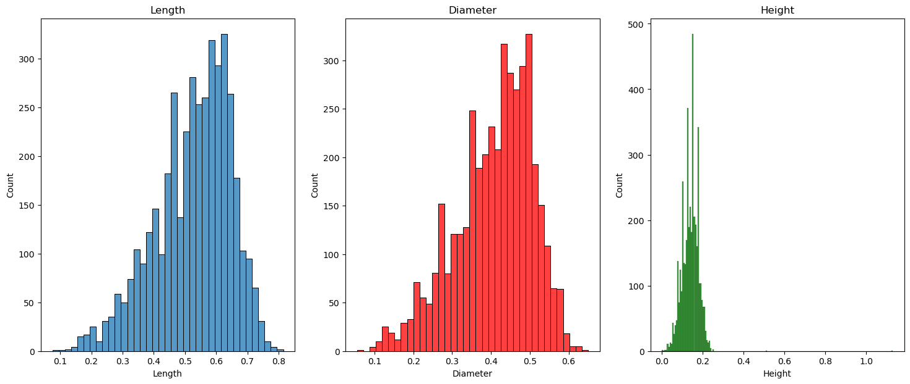
    


```python
figure, axes = plt.subplots(2, 2, figsize=(15,10))
axes[0,0].set_title('Whole weight')
axes[0,1].set_title('Shucked weight')
axes[1,0].set_title('Viscera weight')
axes[1,1].set_title('Shell weight')
sns.histplot(ax=axes[0,0], data=df, x='Whole weight')
sns.histplot(ax=axes[0,1], data=df, x='Shucked weight', color='red')
sns.histplot(ax=axes[1,0], data=df, x='Viscera weight',color='green')
sns.histplot(ax=axes[1,1], data=df, x='Shell weight',color='black')
```


    <AxesSubplot:title={'center':'Shell weight'}, xlabel='Shell weight', ylabel='Count'>


    
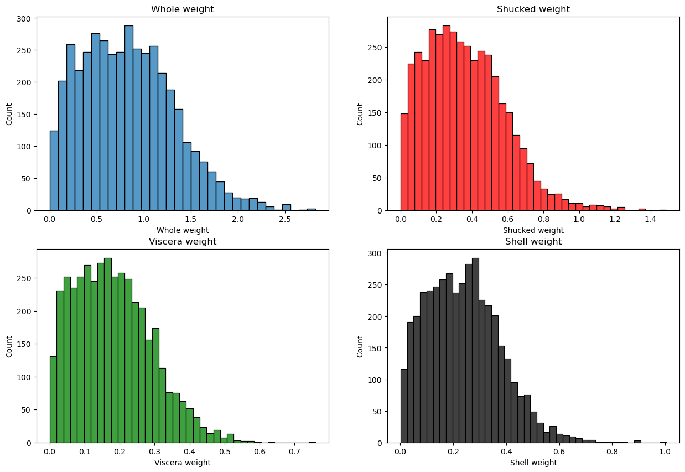
    


```python
figure, axes = plt.subplots(1, 1, figsize=(10,5))
axes.set_title('Rings')
sns.histplot(ax=axes, data=df, x='Rings')
```


    <AxesSubplot:title={'center':'Rings'}, xlabel='Rings', ylabel='Count'>


    
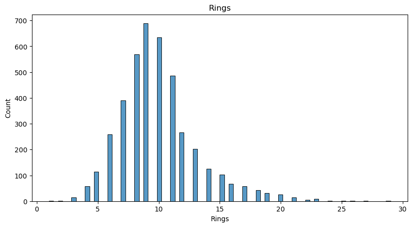
    


```python
figure, axes = plt.subplots(1, 1, figsize=(15,10))
axes.set_title('Length')
sns.scatterplot(ax=axes, data=df1, x='Length', y='years')
```


    <AxesSubplot:title={'center':'Length'}, xlabel='Length', ylabel='years'>


    
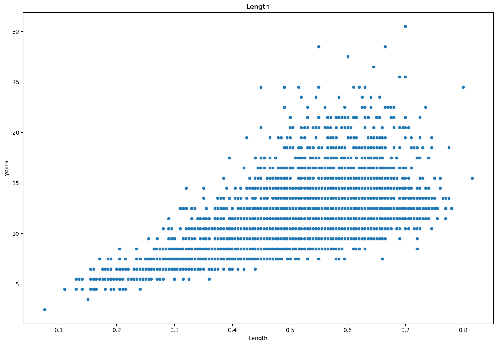
    


```python
figure, axes = plt.subplots(1, 1, figsize=(15,10))
axes.set_title('Diameter')
sns.scatterplot(ax=axes, data=df1, x='Diameter', color='red',y='years')
plt.show()
```


    
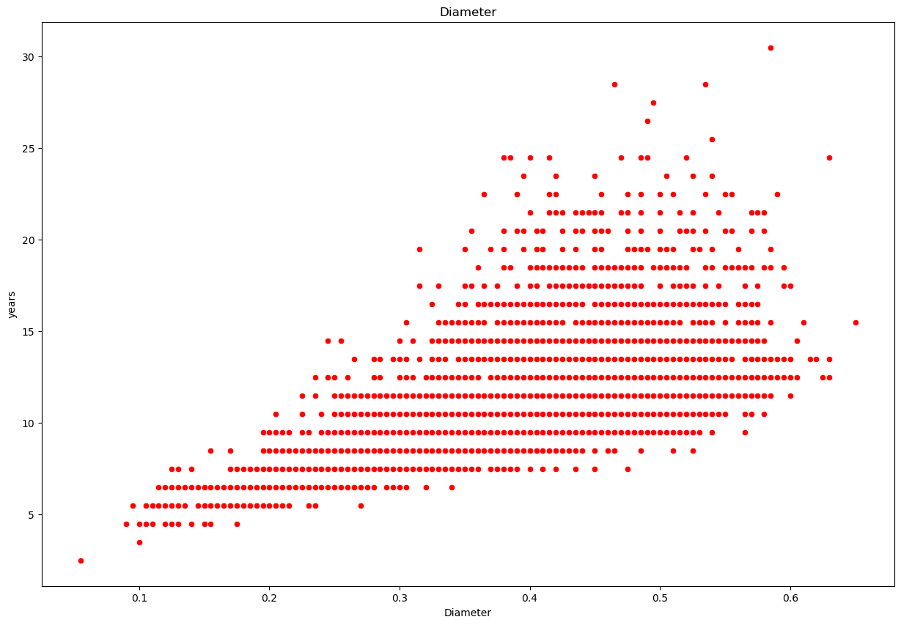
    


```python
figure, axes = plt.subplots(1, 1, figsize=(15,10))
axes.set_title('Height')

sns.scatterplot(ax=axes, data=df1, x='Height',color='green', y='years')
plt.show()
```


    
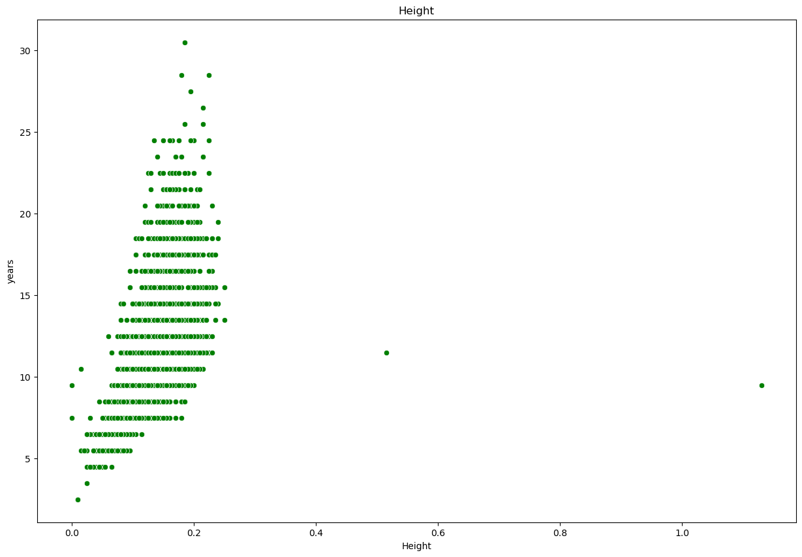
    


```python
figure, axes = plt.subplots(1, 1, figsize=(15,10))
axes.set_title('Whole weight')
sns.scatterplot(ax=axes, data=df1, x='Whole weight', y='years')
plt.show()
```


    
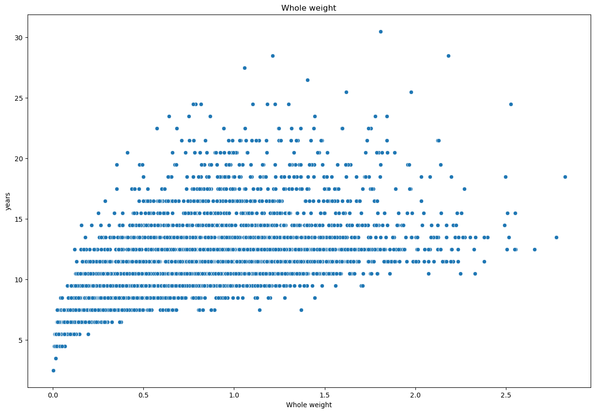
    


```python
figure, axes = plt.subplots(1, 1, figsize=(15,10))
axes.set_title('Shucked weight')
sns.scatterplot(ax=axes, data=df1, x='Shucked weight', color='red', y='years')
```


    <AxesSubplot:title={'center':'Shucked weight'}, xlabel='Shucked weight', ylabel='years'>


    
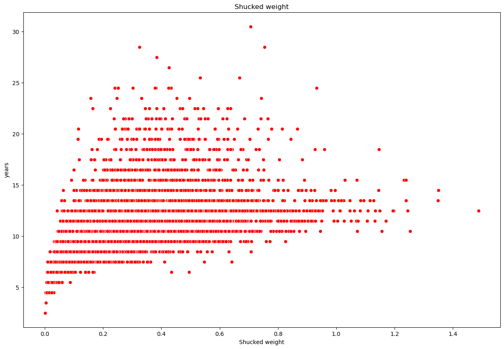
    


```python
figure, axes = plt.subplots(1, 1, figsize=(15,10))
axes.set_title('Viscera weight')
sns.scatterplot(ax=axes, data=df1, x='Viscera weight',color='green', y='years')
```


    <AxesSubplot:title={'center':'Viscera weight'}, xlabel='Viscera weight', ylabel='years'>


    
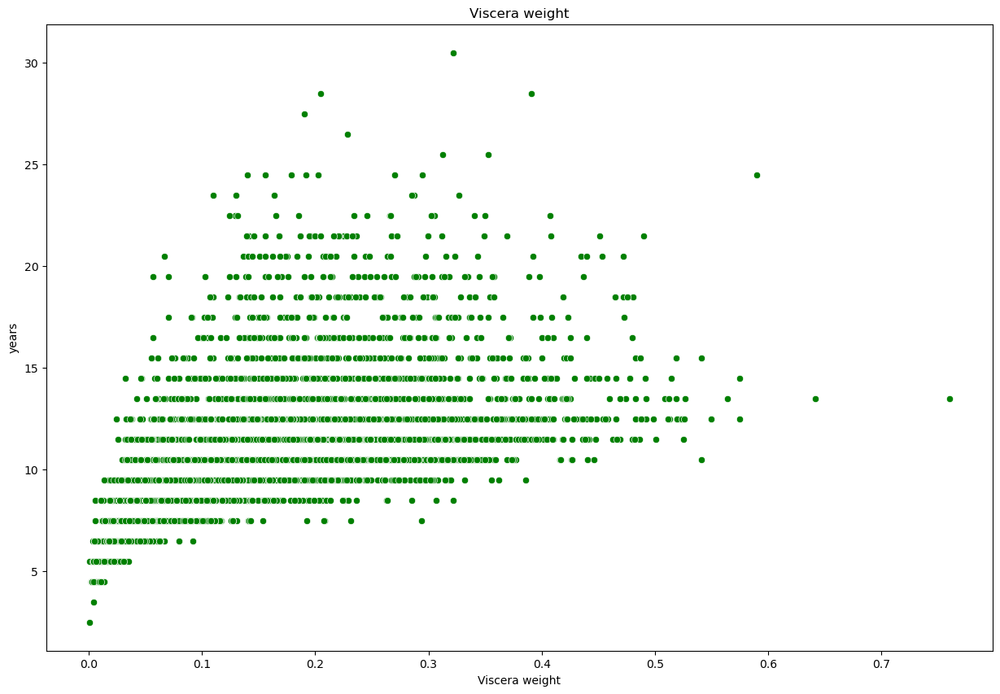
    


```python
figure, axes = plt.subplots(1, 1, figsize=(15,10))
axes.set_title('Shell weight')
sns.scatterplot(ax=axes, data=df1, x='Shell weight',color='black', y='years')
```


    <AxesSubplot:title={'center':'Shell weight'}, xlabel='Shell weight', ylabel='years'>


    
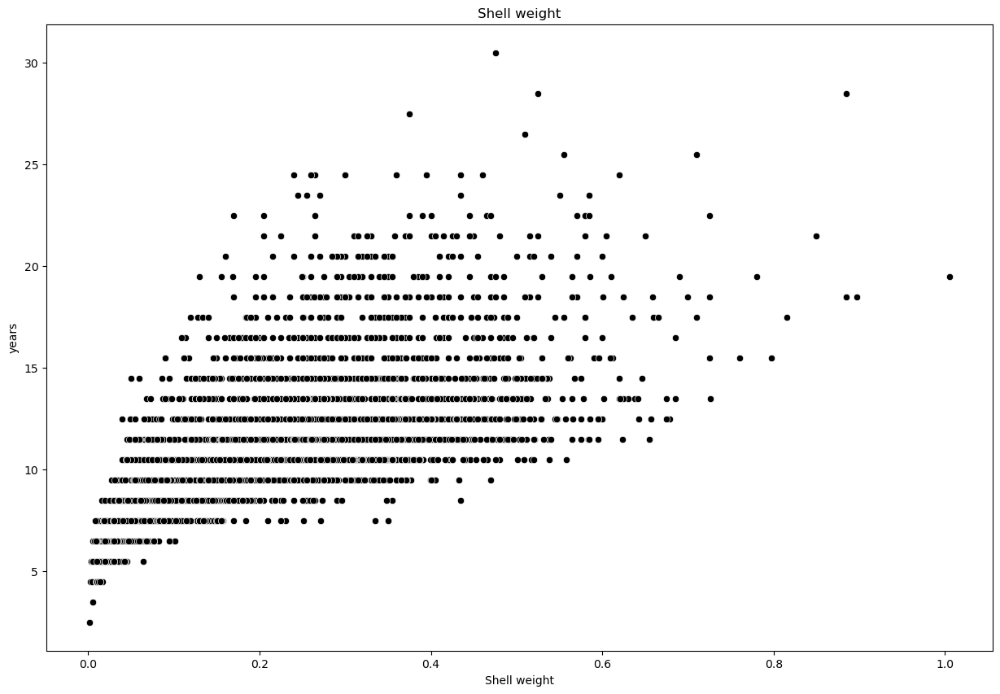
    


```python
df.corr()
```


<div>
<style scoped>
    .dataframe tbody tr th:only-of-type {
        vertical-align: middle;
    }

    .dataframe tbody tr th {
        vertical-align: top;
    }

    .dataframe thead th {
        text-align: right;
    }
</style>
<table border="1" class="dataframe">
  <thead>
    <tr style="text-align: right;">
      <th></th>
      <th>Length</th>
      <th>Diameter</th>
      <th>Height</th>
      <th>Whole weight</th>
      <th>Shucked weight</th>
      <th>Viscera weight</th>
      <th>Shell weight</th>
      <th>Rings</th>
    </tr>
  </thead>
  <tbody>
    <tr>
      <th>Length</th>
      <td>1.000000</td>
      <td>0.986812</td>
      <td>0.827554</td>
      <td>0.925261</td>
      <td>0.897914</td>
      <td>0.903018</td>
      <td>0.897706</td>
      <td>0.556720</td>
    </tr>
    <tr>
      <th>Diameter</th>
      <td>0.986812</td>
      <td>1.000000</td>
      <td>0.833684</td>
      <td>0.925452</td>
      <td>0.893162</td>
      <td>0.899724</td>
      <td>0.905330</td>
      <td>0.574660</td>
    </tr>
    <tr>
      <th>Height</th>
      <td>0.827554</td>
      <td>0.833684</td>
      <td>1.000000</td>
      <td>0.819221</td>
      <td>0.774972</td>
      <td>0.798319</td>
      <td>0.817338</td>
      <td>0.557467</td>
    </tr>
    <tr>
      <th>Whole weight</th>
      <td>0.925261</td>
      <td>0.925452</td>
      <td>0.819221</td>
      <td>1.000000</td>
      <td>0.969405</td>
      <td>0.966375</td>
      <td>0.955355</td>
      <td>0.540390</td>
    </tr>
    <tr>
      <th>Shucked weight</th>
      <td>0.897914</td>
      <td>0.893162</td>
      <td>0.774972</td>
      <td>0.969405</td>
      <td>1.000000</td>
      <td>0.931961</td>
      <td>0.882617</td>
      <td>0.420884</td>
    </tr>
    <tr>
      <th>Viscera weight</th>
      <td>0.903018</td>
      <td>0.899724</td>
      <td>0.798319</td>
      <td>0.966375</td>
      <td>0.931961</td>
      <td>1.000000</td>
      <td>0.907656</td>
      <td>0.503819</td>
    </tr>
    <tr>
      <th>Shell weight</th>
      <td>0.897706</td>
      <td>0.905330</td>
      <td>0.817338</td>
      <td>0.955355</td>
      <td>0.882617</td>
      <td>0.907656</td>
      <td>1.000000</td>
      <td>0.627574</td>
    </tr>
    <tr>
      <th>Rings</th>
      <td>0.556720</td>
      <td>0.574660</td>
      <td>0.557467</td>
      <td>0.540390</td>
      <td>0.420884</td>
      <td>0.503819</td>
      <td>0.627574</td>
      <td>1.000000</td>
    </tr>
  </tbody>
</table>
</div>


```python
df1
```


<div>
<style scoped>
    .dataframe tbody tr th:only-of-type {
        vertical-align: middle;
    }

    .dataframe tbody tr th {
        vertical-align: top;
    }

    .dataframe thead th {
        text-align: right;
    }
</style>
<table border="1" class="dataframe">
  <thead>
    <tr style="text-align: right;">
      <th></th>
      <th>Length</th>
      <th>Diameter</th>
      <th>Height</th>
      <th>Whole weight</th>
      <th>Shucked weight</th>
      <th>Viscera weight</th>
      <th>Shell weight</th>
      <th>Rings</th>
      <th>Sex_F</th>
      <th>Sex_I</th>
      <th>Sex_M</th>
      <th>years</th>
      <th>Rings_min</th>
      <th>years_min</th>
    </tr>
  </thead>
  <tbody>
    <tr>
      <th>0</th>
      <td>0.455</td>
      <td>0.365</td>
      <td>0.095</td>
      <td>0.5140</td>
      <td>0.2245</td>
      <td>0.1010</td>
      <td>0.1500</td>
      <td>15</td>
      <td>0</td>
      <td>0</td>
      <td>1</td>
      <td>16.5</td>
      <td>0.500000</td>
      <td>0.500000</td>
    </tr>
    <tr>
      <th>1</th>
      <td>0.350</td>
      <td>0.265</td>
      <td>0.090</td>
      <td>0.2255</td>
      <td>0.0995</td>
      <td>0.0485</td>
      <td>0.0700</td>
      <td>7</td>
      <td>0</td>
      <td>0</td>
      <td>1</td>
      <td>8.5</td>
      <td>0.214286</td>
      <td>0.214286</td>
    </tr>
    <tr>
      <th>2</th>
      <td>0.530</td>
      <td>0.420</td>
      <td>0.135</td>
      <td>0.6770</td>
      <td>0.2565</td>
      <td>0.1415</td>
      <td>0.2100</td>
      <td>9</td>
      <td>1</td>
      <td>0</td>
      <td>0</td>
      <td>10.5</td>
      <td>0.285714</td>
      <td>0.285714</td>
    </tr>
    <tr>
      <th>3</th>
      <td>0.440</td>
      <td>0.365</td>
      <td>0.125</td>
      <td>0.5160</td>
      <td>0.2155</td>
      <td>0.1140</td>
      <td>0.1550</td>
      <td>10</td>
      <td>0</td>
      <td>0</td>
      <td>1</td>
      <td>11.5</td>
      <td>0.321429</td>
      <td>0.321429</td>
    </tr>
    <tr>
      <th>4</th>
      <td>0.330</td>
      <td>0.255</td>
      <td>0.080</td>
      <td>0.2050</td>
      <td>0.0895</td>
      <td>0.0395</td>
      <td>0.0550</td>
      <td>7</td>
      <td>0</td>
      <td>1</td>
      <td>0</td>
      <td>8.5</td>
      <td>0.214286</td>
      <td>0.214286</td>
    </tr>
    <tr>
      <th>...</th>
      <td>...</td>
      <td>...</td>
      <td>...</td>
      <td>...</td>
      <td>...</td>
      <td>...</td>
      <td>...</td>
      <td>...</td>
      <td>...</td>
      <td>...</td>
      <td>...</td>
      <td>...</td>
      <td>...</td>
      <td>...</td>
    </tr>
    <tr>
      <th>4172</th>
      <td>0.565</td>
      <td>0.450</td>
      <td>0.165</td>
      <td>0.8870</td>
      <td>0.3700</td>
      <td>0.2390</td>
      <td>0.2490</td>
      <td>11</td>
      <td>1</td>
      <td>0</td>
      <td>0</td>
      <td>12.5</td>
      <td>0.357143</td>
      <td>0.357143</td>
    </tr>
    <tr>
      <th>4173</th>
      <td>0.590</td>
      <td>0.440</td>
      <td>0.135</td>
      <td>0.9660</td>
      <td>0.4390</td>
      <td>0.2145</td>
      <td>0.2605</td>
      <td>10</td>
      <td>0</td>
      <td>0</td>
      <td>1</td>
      <td>11.5</td>
      <td>0.321429</td>
      <td>0.321429</td>
    </tr>
    <tr>
      <th>4174</th>
      <td>0.600</td>
      <td>0.475</td>
      <td>0.205</td>
      <td>1.1760</td>
      <td>0.5255</td>
      <td>0.2875</td>
      <td>0.3080</td>
      <td>9</td>
      <td>0</td>
      <td>0</td>
      <td>1</td>
      <td>10.5</td>
      <td>0.285714</td>
      <td>0.285714</td>
    </tr>
    <tr>
      <th>4175</th>
      <td>0.625</td>
      <td>0.485</td>
      <td>0.150</td>
      <td>1.0945</td>
      <td>0.5310</td>
      <td>0.2610</td>
      <td>0.2960</td>
      <td>10</td>
      <td>1</td>
      <td>0</td>
      <td>0</td>
      <td>11.5</td>
      <td>0.321429</td>
      <td>0.321429</td>
    </tr>
    <tr>
      <th>4176</th>
      <td>0.710</td>
      <td>0.555</td>
      <td>0.195</td>
      <td>1.9485</td>
      <td>0.9455</td>
      <td>0.3765</td>
      <td>0.4950</td>
      <td>12</td>
      <td>0</td>
      <td>0</td>
      <td>1</td>
      <td>13.5</td>
      <td>0.392857</td>
      <td>0.392857</td>
    </tr>
  </tbody>
</table>
<p>4177 rows × 14 columns</p>
</div>


```python

sns.pairplot(df1.drop(['Rings','Sex_F','Sex_I','Sex_M','Shell weight','Viscera weight','Shucked weight','Whole weight','Rings_min','years_min'],axis='columns'))
plt.show()
```


    
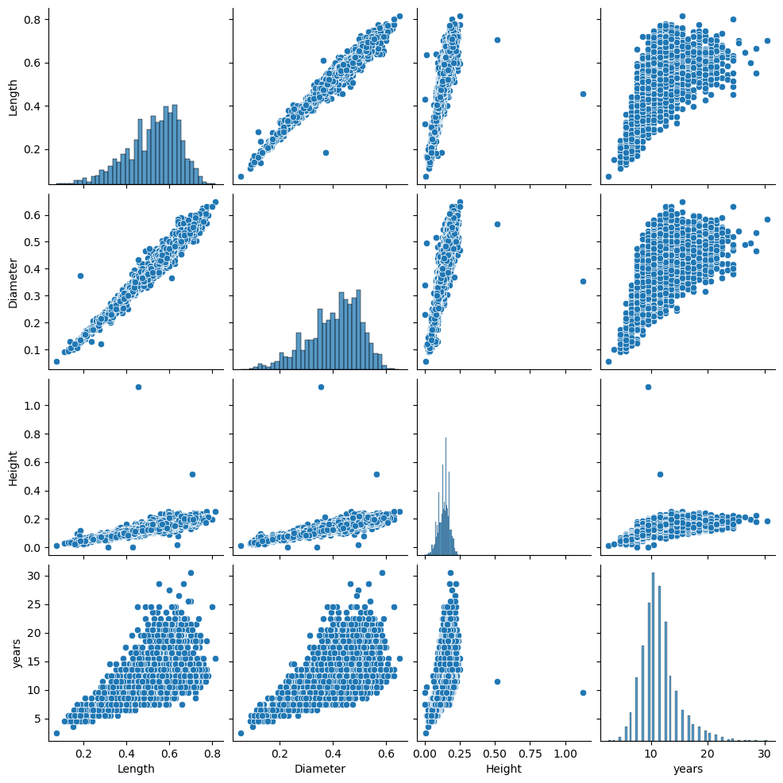
    


```python
sns.pairplot(df1.drop(['Rings','Sex_F','Sex_I','Sex_M','Length','Diameter','Height','years_min','Rings_min'],axis='columns'))
plt.show()
```


    
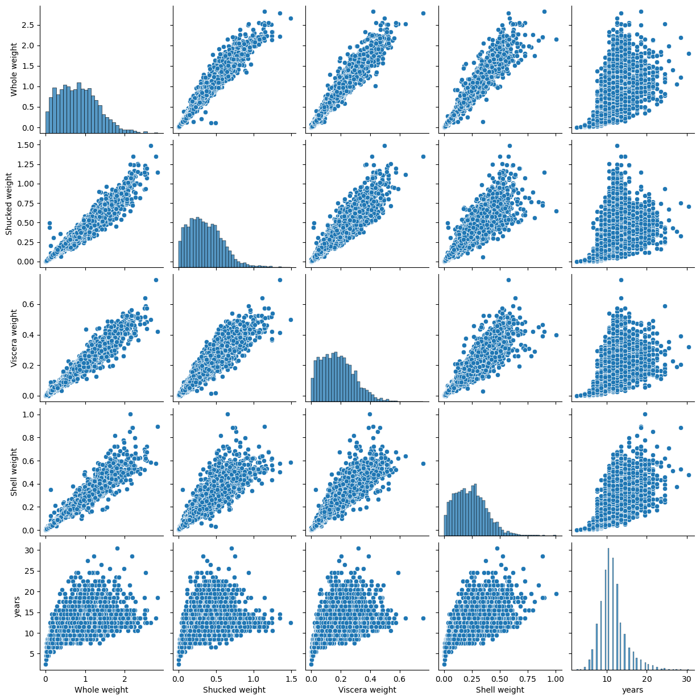
    


```python
sns.heatmap(df1.corr(), annot=True, annot_kws={"size": 7})
plt.show()
```


    
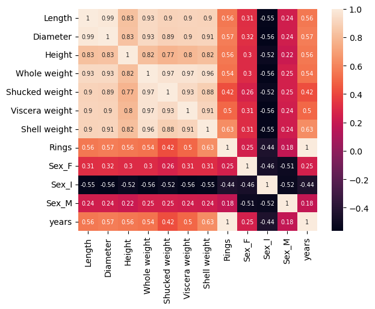
    


```python
df1 = pd.get_dummies(df, columns = ['Sex'])
df1['years'] = df1['Rings'] + 1.5
df1
```


<div>
<style scoped>
    .dataframe tbody tr th:only-of-type {
        vertical-align: middle;
    }

    .dataframe tbody tr th {
        vertical-align: top;
    }

    .dataframe thead th {
        text-align: right;
    }
</style>
<table border="1" class="dataframe">
  <thead>
    <tr style="text-align: right;">
      <th></th>
      <th>Length</th>
      <th>Diameter</th>
      <th>Height</th>
      <th>Whole weight</th>
      <th>Shucked weight</th>
      <th>Viscera weight</th>
      <th>Shell weight</th>
      <th>Rings</th>
      <th>Sex_F</th>
      <th>Sex_I</th>
      <th>Sex_M</th>
      <th>years</th>
    </tr>
  </thead>
  <tbody>
    <tr>
      <th>0</th>
      <td>0.455</td>
      <td>0.365</td>
      <td>0.095</td>
      <td>0.5140</td>
      <td>0.2245</td>
      <td>0.1010</td>
      <td>0.1500</td>
      <td>15</td>
      <td>0</td>
      <td>0</td>
      <td>1</td>
      <td>16.5</td>
    </tr>
    <tr>
      <th>1</th>
      <td>0.350</td>
      <td>0.265</td>
      <td>0.090</td>
      <td>0.2255</td>
      <td>0.0995</td>
      <td>0.0485</td>
      <td>0.0700</td>
      <td>7</td>
      <td>0</td>
      <td>0</td>
      <td>1</td>
      <td>8.5</td>
    </tr>
    <tr>
      <th>2</th>
      <td>0.530</td>
      <td>0.420</td>
      <td>0.135</td>
      <td>0.6770</td>
      <td>0.2565</td>
      <td>0.1415</td>
      <td>0.2100</td>
      <td>9</td>
      <td>1</td>
      <td>0</td>
      <td>0</td>
      <td>10.5</td>
    </tr>
    <tr>
      <th>3</th>
      <td>0.440</td>
      <td>0.365</td>
      <td>0.125</td>
      <td>0.5160</td>
      <td>0.2155</td>
      <td>0.1140</td>
      <td>0.1550</td>
      <td>10</td>
      <td>0</td>
      <td>0</td>
      <td>1</td>
      <td>11.5</td>
    </tr>
    <tr>
      <th>4</th>
      <td>0.330</td>
      <td>0.255</td>
      <td>0.080</td>
      <td>0.2050</td>
      <td>0.0895</td>
      <td>0.0395</td>
      <td>0.0550</td>
      <td>7</td>
      <td>0</td>
      <td>1</td>
      <td>0</td>
      <td>8.5</td>
    </tr>
    <tr>
      <th>...</th>
      <td>...</td>
      <td>...</td>
      <td>...</td>
      <td>...</td>
      <td>...</td>
      <td>...</td>
      <td>...</td>
      <td>...</td>
      <td>...</td>
      <td>...</td>
      <td>...</td>
      <td>...</td>
    </tr>
    <tr>
      <th>4172</th>
      <td>0.565</td>
      <td>0.450</td>
      <td>0.165</td>
      <td>0.8870</td>
      <td>0.3700</td>
      <td>0.2390</td>
      <td>0.2490</td>
      <td>11</td>
      <td>1</td>
      <td>0</td>
      <td>0</td>
      <td>12.5</td>
    </tr>
    <tr>
      <th>4173</th>
      <td>0.590</td>
      <td>0.440</td>
      <td>0.135</td>
      <td>0.9660</td>
      <td>0.4390</td>
      <td>0.2145</td>
      <td>0.2605</td>
      <td>10</td>
      <td>0</td>
      <td>0</td>
      <td>1</td>
      <td>11.5</td>
    </tr>
    <tr>
      <th>4174</th>
      <td>0.600</td>
      <td>0.475</td>
      <td>0.205</td>
      <td>1.1760</td>
      <td>0.5255</td>
      <td>0.2875</td>
      <td>0.3080</td>
      <td>9</td>
      <td>0</td>
      <td>0</td>
      <td>1</td>
      <td>10.5</td>
    </tr>
    <tr>
      <th>4175</th>
      <td>0.625</td>
      <td>0.485</td>
      <td>0.150</td>
      <td>1.0945</td>
      <td>0.5310</td>
      <td>0.2610</td>
      <td>0.2960</td>
      <td>10</td>
      <td>1</td>
      <td>0</td>
      <td>0</td>
      <td>11.5</td>
    </tr>
    <tr>
      <th>4176</th>
      <td>0.710</td>
      <td>0.555</td>
      <td>0.195</td>
      <td>1.9485</td>
      <td>0.9455</td>
      <td>0.3765</td>
      <td>0.4950</td>
      <td>12</td>
      <td>0</td>
      <td>0</td>
      <td>1</td>
      <td>13.5</td>
    </tr>
  </tbody>
</table>
<p>4177 rows × 12 columns</p>
</div>


```python
X = df1.drop(['Rings','Sex_I','years'],axis='columns')
y = df1['years']

X_train, X_test, y_train, y_test = train_test_split(X, y, test_size=0.2)
```


```python
from sklearn import linear_model
reg = linear_model.LinearRegression()
reg.fit(X,y)
```


    LinearRegression()


```python
reg.coef_
```


    array([ -0.45833542,  11.07510254,  10.7615367 ,   8.97544462,
           -19.78686686, -10.58182703,   8.7418058 ,   0.82487626,
             0.88259194])


```python
y_pred = reg.predict(X_test)
```


```python
reg.score(X_test,y_test)
```


    0.5195373764697822


```python
X
```


<div>
<style scoped>
    .dataframe tbody tr th:only-of-type {
        vertical-align: middle;
    }

    .dataframe tbody tr th {
        vertical-align: top;
    }

    .dataframe thead th {
        text-align: right;
    }
</style>
<table border="1" class="dataframe">
  <thead>
    <tr style="text-align: right;">
      <th></th>
      <th>Length</th>
      <th>Diameter</th>
      <th>Height</th>
      <th>Whole weight</th>
      <th>Shucked weight</th>
      <th>Viscera weight</th>
      <th>Shell weight</th>
      <th>Sex_F</th>
      <th>Sex_M</th>
    </tr>
  </thead>
  <tbody>
    <tr>
      <th>0</th>
      <td>0.455</td>
      <td>0.365</td>
      <td>0.095</td>
      <td>0.5140</td>
      <td>0.2245</td>
      <td>0.1010</td>
      <td>0.1500</td>
      <td>0</td>
      <td>1</td>
    </tr>
    <tr>
      <th>1</th>
      <td>0.350</td>
      <td>0.265</td>
      <td>0.090</td>
      <td>0.2255</td>
      <td>0.0995</td>
      <td>0.0485</td>
      <td>0.0700</td>
      <td>0</td>
      <td>1</td>
    </tr>
    <tr>
      <th>2</th>
      <td>0.530</td>
      <td>0.420</td>
      <td>0.135</td>
      <td>0.6770</td>
      <td>0.2565</td>
      <td>0.1415</td>
      <td>0.2100</td>
      <td>1</td>
      <td>0</td>
    </tr>
    <tr>
      <th>3</th>
      <td>0.440</td>
      <td>0.365</td>
      <td>0.125</td>
      <td>0.5160</td>
      <td>0.2155</td>
      <td>0.1140</td>
      <td>0.1550</td>
      <td>0</td>
      <td>1</td>
    </tr>
    <tr>
      <th>4</th>
      <td>0.330</td>
      <td>0.255</td>
      <td>0.080</td>
      <td>0.2050</td>
      <td>0.0895</td>
      <td>0.0395</td>
      <td>0.0550</td>
      <td>0</td>
      <td>0</td>
    </tr>
    <tr>
      <th>...</th>
      <td>...</td>
      <td>...</td>
      <td>...</td>
      <td>...</td>
      <td>...</td>
      <td>...</td>
      <td>...</td>
      <td>...</td>
      <td>...</td>
    </tr>
    <tr>
      <th>4172</th>
      <td>0.565</td>
      <td>0.450</td>
      <td>0.165</td>
      <td>0.8870</td>
      <td>0.3700</td>
      <td>0.2390</td>
      <td>0.2490</td>
      <td>1</td>
      <td>0</td>
    </tr>
    <tr>
      <th>4173</th>
      <td>0.590</td>
      <td>0.440</td>
      <td>0.135</td>
      <td>0.9660</td>
      <td>0.4390</td>
      <td>0.2145</td>
      <td>0.2605</td>
      <td>0</td>
      <td>1</td>
    </tr>
    <tr>
      <th>4174</th>
      <td>0.600</td>
      <td>0.475</td>
      <td>0.205</td>
      <td>1.1760</td>
      <td>0.5255</td>
      <td>0.2875</td>
      <td>0.3080</td>
      <td>0</td>
      <td>1</td>
    </tr>
    <tr>
      <th>4175</th>
      <td>0.625</td>
      <td>0.485</td>
      <td>0.150</td>
      <td>1.0945</td>
      <td>0.5310</td>
      <td>0.2610</td>
      <td>0.2960</td>
      <td>1</td>
      <td>0</td>
    </tr>
    <tr>
      <th>4176</th>
      <td>0.710</td>
      <td>0.555</td>
      <td>0.195</td>
      <td>1.9485</td>
      <td>0.9455</td>
      <td>0.3765</td>
      <td>0.4950</td>
      <td>0</td>
      <td>1</td>
    </tr>
  </tbody>
</table>
<p>4177 rows × 9 columns</p>
</div>


```python
y
```


    0       16.5
    1        8.5
    2       10.5
    3       11.5
    4        8.5
            ... 
    4172    12.5
    4173    11.5
    4174    10.5
    4175    11.5
    4176    13.5
    Name: years, Length: 4177, dtype: float64


```python
df1
```


<div>
<style scoped>
    .dataframe tbody tr th:only-of-type {
        vertical-align: middle;
    }

    .dataframe tbody tr th {
        vertical-align: top;
    }

    .dataframe thead th {
        text-align: right;
    }
</style>
<table border="1" class="dataframe">
  <thead>
    <tr style="text-align: right;">
      <th></th>
      <th>Length</th>
      <th>Diameter</th>
      <th>Height</th>
      <th>Whole weight</th>
      <th>Shucked weight</th>
      <th>Viscera weight</th>
      <th>Shell weight</th>
      <th>Rings</th>
      <th>Sex_F</th>
      <th>Sex_I</th>
      <th>Sex_M</th>
      <th>years</th>
      <th>Rings_min</th>
      <th>years_min</th>
    </tr>
  </thead>
  <tbody>
    <tr>
      <th>0</th>
      <td>0.455</td>
      <td>0.365</td>
      <td>0.095</td>
      <td>0.5140</td>
      <td>0.2245</td>
      <td>0.1010</td>
      <td>0.1500</td>
      <td>15</td>
      <td>0</td>
      <td>0</td>
      <td>1</td>
      <td>16.5</td>
      <td>0.500000</td>
      <td>0.500000</td>
    </tr>
    <tr>
      <th>1</th>
      <td>0.350</td>
      <td>0.265</td>
      <td>0.090</td>
      <td>0.2255</td>
      <td>0.0995</td>
      <td>0.0485</td>
      <td>0.0700</td>
      <td>7</td>
      <td>0</td>
      <td>0</td>
      <td>1</td>
      <td>8.5</td>
      <td>0.214286</td>
      <td>0.214286</td>
    </tr>
    <tr>
      <th>2</th>
      <td>0.530</td>
      <td>0.420</td>
      <td>0.135</td>
      <td>0.6770</td>
      <td>0.2565</td>
      <td>0.1415</td>
      <td>0.2100</td>
      <td>9</td>
      <td>1</td>
      <td>0</td>
      <td>0</td>
      <td>10.5</td>
      <td>0.285714</td>
      <td>0.285714</td>
    </tr>
    <tr>
      <th>3</th>
      <td>0.440</td>
      <td>0.365</td>
      <td>0.125</td>
      <td>0.5160</td>
      <td>0.2155</td>
      <td>0.1140</td>
      <td>0.1550</td>
      <td>10</td>
      <td>0</td>
      <td>0</td>
      <td>1</td>
      <td>11.5</td>
      <td>0.321429</td>
      <td>0.321429</td>
    </tr>
    <tr>
      <th>4</th>
      <td>0.330</td>
      <td>0.255</td>
      <td>0.080</td>
      <td>0.2050</td>
      <td>0.0895</td>
      <td>0.0395</td>
      <td>0.0550</td>
      <td>7</td>
      <td>0</td>
      <td>1</td>
      <td>0</td>
      <td>8.5</td>
      <td>0.214286</td>
      <td>0.214286</td>
    </tr>
    <tr>
      <th>...</th>
      <td>...</td>
      <td>...</td>
      <td>...</td>
      <td>...</td>
      <td>...</td>
      <td>...</td>
      <td>...</td>
      <td>...</td>
      <td>...</td>
      <td>...</td>
      <td>...</td>
      <td>...</td>
      <td>...</td>
      <td>...</td>
    </tr>
    <tr>
      <th>4172</th>
      <td>0.565</td>
      <td>0.450</td>
      <td>0.165</td>
      <td>0.8870</td>
      <td>0.3700</td>
      <td>0.2390</td>
      <td>0.2490</td>
      <td>11</td>
      <td>1</td>
      <td>0</td>
      <td>0</td>
      <td>12.5</td>
      <td>0.357143</td>
      <td>0.357143</td>
    </tr>
    <tr>
      <th>4173</th>
      <td>0.590</td>
      <td>0.440</td>
      <td>0.135</td>
      <td>0.9660</td>
      <td>0.4390</td>
      <td>0.2145</td>
      <td>0.2605</td>
      <td>10</td>
      <td>0</td>
      <td>0</td>
      <td>1</td>
      <td>11.5</td>
      <td>0.321429</td>
      <td>0.321429</td>
    </tr>
    <tr>
      <th>4174</th>
      <td>0.600</td>
      <td>0.475</td>
      <td>0.205</td>
      <td>1.1760</td>
      <td>0.5255</td>
      <td>0.2875</td>
      <td>0.3080</td>
      <td>9</td>
      <td>0</td>
      <td>0</td>
      <td>1</td>
      <td>10.5</td>
      <td>0.285714</td>
      <td>0.285714</td>
    </tr>
    <tr>
      <th>4175</th>
      <td>0.625</td>
      <td>0.485</td>
      <td>0.150</td>
      <td>1.0945</td>
      <td>0.5310</td>
      <td>0.2610</td>
      <td>0.2960</td>
      <td>10</td>
      <td>1</td>
      <td>0</td>
      <td>0</td>
      <td>11.5</td>
      <td>0.321429</td>
      <td>0.321429</td>
    </tr>
    <tr>
      <th>4176</th>
      <td>0.710</td>
      <td>0.555</td>
      <td>0.195</td>
      <td>1.9485</td>
      <td>0.9455</td>
      <td>0.3765</td>
      <td>0.4950</td>
      <td>12</td>
      <td>0</td>
      <td>0</td>
      <td>1</td>
      <td>13.5</td>
      <td>0.392857</td>
      <td>0.392857</td>
    </tr>
  </tbody>
</table>
<p>4177 rows × 14 columns</p>
</div>


```python
X = df1.drop(['Rings','Sex_I','years','Rings_min','years_min'],axis='columns')
y = df1['years']
from sklearn.model_selection import train_test_split
poly = PolynomialFeatures(degree=2, include_bias=False)
poly_features = poly.fit_transform(X)
X_train, X_test, y_train, y_test = train_test_split(poly_features, y, test_size=0.2, random_state=42)
```


```python
X_train
```


    array([[0.55 , 0.445, 0.125, ..., 0.   , 0.   , 0.   ],
           [0.475, 0.355, 0.1  , ..., 0.   , 0.   , 0.   ],
           [0.305, 0.225, 0.07 , ..., 1.   , 0.   , 0.   ],
           ...,
           [0.51 , 0.395, 0.125, ..., 0.   , 0.   , 1.   ],
           [0.575, 0.465, 0.12 , ..., 0.   , 0.   , 1.   ],
           [0.595, 0.475, 0.16 , ..., 1.   , 0.   , 0.   ]])


```python
y_train
```


    4038    12.5
    1272     9.5
    3384     8.5
    3160     8.5
    3894    13.5
            ... 
    3444    10.5
    466     13.5
    3092    12.5
    3772    10.5
    860      7.5
    Name: years, Length: 3341, dtype: float64


```python
poly_reg_model = LinearRegression()
poly_reg_model.fit(X_train, y_train)
```


    LinearRegression()


```python
poly_reg_y_predicted = poly_reg_model.predict(X_test)
from sklearn.metrics import mean_squared_error
poly_reg_rmse = np.sqrt(mean_squared_error(y_test, poly_reg_y_predicted))
poly_reg_rmse
```


    2.1977190308900383


```python
poly_reg_model.score(X_test,y_test)
```


    0.5538221504793466


```python
poly_reg_model.score(X_train,y_train)
```


    0.5924451811600513


```python
poly_reg_model.coef_
```


    array([-4.95636148e+00,  4.79092721e+01,  1.42873237e+01,  9.69648816e+00,
           -4.69037151e+01,  2.10153599e+01,  3.13897818e+01, -3.81475994e-01,
           -4.43363775e-01,  1.45215182e+01, -6.18627300e+01,  4.04842825e+01,
           -4.90483876e+01,  1.07875816e+02, -1.13093933e+02,  5.71772068e+01,
            1.32572947e+01,  1.51613887e+01, -3.82139645e+01, -2.21312785e+01,
            9.44143603e+01, -8.34182696e+01,  7.30198620e+01, -1.46663560e+02,
           -3.66712076e+00, -7.68721413e+00, -3.15371431e+00,  5.93882552e+01,
           -8.14094108e+01, -1.43308651e+02,  7.22145593e-01, -1.13416088e+01,
           -8.86227610e+00, -6.52255062e+00, -1.74976427e+01,  7.82422229e-02,
            1.61544652e+01, -4.51049306e+00, -4.36307994e+00,  3.15612039e+01,
            2.81739298e+01, -6.68833071e+00, -4.76630563e+00, -3.58907496e+00,
            2.15078173e+01, -5.55269281e+00,  6.37128610e+00,  1.45129530e+00,
           -1.04618243e+01,  4.16119789e+00,  7.34607203e+00, -3.81475994e-01,
            0.00000000e+00, -4.43363775e-01])


```python
poly_reg_model.intercept_
```


    0.6107318140474884


```python
X_train, X_test, y_train, y_test = train_test_split(X, y, test_size=0.2, random_state=42)
lin_reg_model = LinearRegression()
lin_reg_model.fit(X_train, y_train)
lin_reg_y_predicted = lin_reg_model.predict(X_test)
lin_reg_rmse = np.sqrt(mean_squared_error(y_test, lin_reg_y_predicted))
lin_reg_rmse
```


    2.211613087121833


```python
lin_reg_model.score(X_test,y_test)
```


    0.5481628137889276


```python
lin_reg_model.score(X_train,y_train)
```


    0.5348243545188456


```python
lin_reg_model.coef_
```


    array([ -0.20155385,  11.12339118,  10.44532535,   8.93217555,
           -20.25654479,  -9.5589163 ,   8.79237823,   0.71897444,
             0.82225058])


```python
lin_reg_model.intercept_
```


    4.524495761818884


```python
X = df1.drop(['Rings','Sex_I','years'],axis='columns')
y = df1['Rings']
from sklearn.model_selection import train_test_split
poly = PolynomialFeatures(degree=2, include_bias=False)
poly_features = poly.fit_transform(X)

X_train, X_test, y_train, y_test = train_test_split(poly_features, y, test_size=0.2, random_state=42)

from sklearn.ensemble import RandomForestClassifier
model = RandomForestClassifier(n_estimators=80)
model.fit(X_train, y_train)
```


    RandomForestClassifier(n_estimators=80)


```python
model.score(X_test,y_test)
```


    0.2511961722488038


```python
df1
```


<div>
<style scoped>
    .dataframe tbody tr th:only-of-type {
        vertical-align: middle;
    }

    .dataframe tbody tr th {
        vertical-align: top;
    }

    .dataframe thead th {
        text-align: right;
    }
</style>
<table border="1" class="dataframe">
  <thead>
    <tr style="text-align: right;">
      <th></th>
      <th>Length</th>
      <th>Diameter</th>
      <th>Height</th>
      <th>Whole weight</th>
      <th>Shucked weight</th>
      <th>Viscera weight</th>
      <th>Shell weight</th>
      <th>Rings</th>
      <th>Sex_F</th>
      <th>Sex_I</th>
      <th>Sex_M</th>
      <th>years</th>
    </tr>
  </thead>
  <tbody>
    <tr>
      <th>0</th>
      <td>0.455</td>
      <td>0.365</td>
      <td>0.095</td>
      <td>0.5140</td>
      <td>0.2245</td>
      <td>0.1010</td>
      <td>0.1500</td>
      <td>15</td>
      <td>0</td>
      <td>0</td>
      <td>1</td>
      <td>16.5</td>
    </tr>
    <tr>
      <th>1</th>
      <td>0.350</td>
      <td>0.265</td>
      <td>0.090</td>
      <td>0.2255</td>
      <td>0.0995</td>
      <td>0.0485</td>
      <td>0.0700</td>
      <td>7</td>
      <td>0</td>
      <td>0</td>
      <td>1</td>
      <td>8.5</td>
    </tr>
    <tr>
      <th>2</th>
      <td>0.530</td>
      <td>0.420</td>
      <td>0.135</td>
      <td>0.6770</td>
      <td>0.2565</td>
      <td>0.1415</td>
      <td>0.2100</td>
      <td>9</td>
      <td>1</td>
      <td>0</td>
      <td>0</td>
      <td>10.5</td>
    </tr>
    <tr>
      <th>3</th>
      <td>0.440</td>
      <td>0.365</td>
      <td>0.125</td>
      <td>0.5160</td>
      <td>0.2155</td>
      <td>0.1140</td>
      <td>0.1550</td>
      <td>10</td>
      <td>0</td>
      <td>0</td>
      <td>1</td>
      <td>11.5</td>
    </tr>
    <tr>
      <th>4</th>
      <td>0.330</td>
      <td>0.255</td>
      <td>0.080</td>
      <td>0.2050</td>
      <td>0.0895</td>
      <td>0.0395</td>
      <td>0.0550</td>
      <td>7</td>
      <td>0</td>
      <td>1</td>
      <td>0</td>
      <td>8.5</td>
    </tr>
    <tr>
      <th>...</th>
      <td>...</td>
      <td>...</td>
      <td>...</td>
      <td>...</td>
      <td>...</td>
      <td>...</td>
      <td>...</td>
      <td>...</td>
      <td>...</td>
      <td>...</td>
      <td>...</td>
      <td>...</td>
    </tr>
    <tr>
      <th>4172</th>
      <td>0.565</td>
      <td>0.450</td>
      <td>0.165</td>
      <td>0.8870</td>
      <td>0.3700</td>
      <td>0.2390</td>
      <td>0.2490</td>
      <td>11</td>
      <td>1</td>
      <td>0</td>
      <td>0</td>
      <td>12.5</td>
    </tr>
    <tr>
      <th>4173</th>
      <td>0.590</td>
      <td>0.440</td>
      <td>0.135</td>
      <td>0.9660</td>
      <td>0.4390</td>
      <td>0.2145</td>
      <td>0.2605</td>
      <td>10</td>
      <td>0</td>
      <td>0</td>
      <td>1</td>
      <td>11.5</td>
    </tr>
    <tr>
      <th>4174</th>
      <td>0.600</td>
      <td>0.475</td>
      <td>0.205</td>
      <td>1.1760</td>
      <td>0.5255</td>
      <td>0.2875</td>
      <td>0.3080</td>
      <td>9</td>
      <td>0</td>
      <td>0</td>
      <td>1</td>
      <td>10.5</td>
    </tr>
    <tr>
      <th>4175</th>
      <td>0.625</td>
      <td>0.485</td>
      <td>0.150</td>
      <td>1.0945</td>
      <td>0.5310</td>
      <td>0.2610</td>
      <td>0.2960</td>
      <td>10</td>
      <td>1</td>
      <td>0</td>
      <td>0</td>
      <td>11.5</td>
    </tr>
    <tr>
      <th>4176</th>
      <td>0.710</td>
      <td>0.555</td>
      <td>0.195</td>
      <td>1.9485</td>
      <td>0.9455</td>
      <td>0.3765</td>
      <td>0.4950</td>
      <td>12</td>
      <td>0</td>
      <td>0</td>
      <td>1</td>
      <td>13.5</td>
    </tr>
  </tbody>
</table>
<p>4177 rows × 12 columns</p>
</div>


```python
figure, axes = plt.subplots(2, 2, figsize=(15,10))
axes[0,0].set_title('Whole weight')
axes[0,1].set_title('Shucked weight')
axes[1,0].set_title('Viscera weight')
axes[1,1].set_title('Shell weight')
sns.boxplot(ax=axes[0,0], data=df, y='Whole weight')
sns.boxplot(ax=axes[0,1], data=df, y='Shucked weight', color='red')
sns.boxplot(ax=axes[1,0], data=df, y='Viscera weight',color='green')
sns.boxplot(ax=axes[1,1], data=df, y='Shell weight',color='yellow')
```


    <AxesSubplot:title={'center':'Shell weight'}, ylabel='Shell weight'>


    
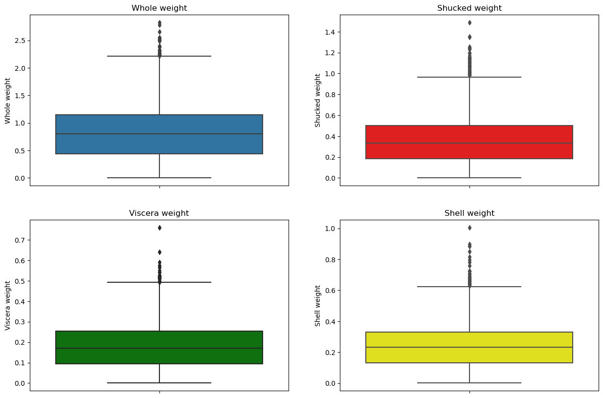
    


```python
figure, axes = plt.subplots(1, 2, figsize=(15,10))
axes[0].set_title('Length')
axes[1].set_title('Diameter')
sns.boxplot(ax=axes[0], data=df, y='Length')
sns.boxplot(ax=axes[1], data=df, y='Diameter', color='red')
```


    <AxesSubplot:title={'center':'Diameter'}, ylabel='Diameter'>


    
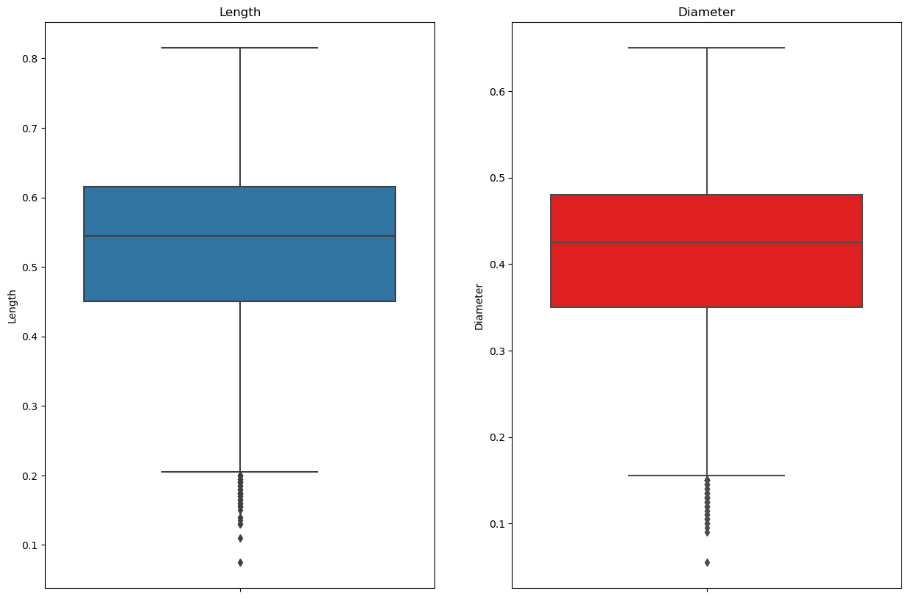
    


```python
figure, axes = plt.subplots(1, 1, figsize=(5,8))
axes.set_title('Height')
sns.boxplot(ax=axes, data=df, y='Height',color='green')
```


    <AxesSubplot:title={'center':'Height'}, ylabel='Height'>


    
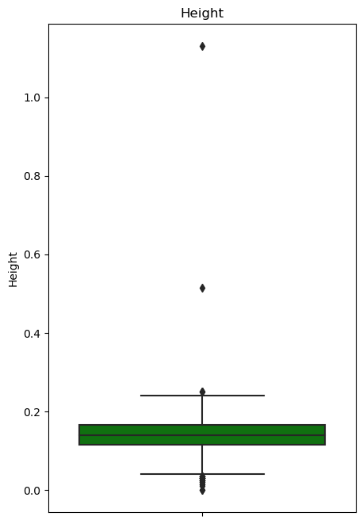
    


```python
figure, axes = plt.subplots(2, 2, figsize=(15,10))
axes[0,0].set_title('Length')
axes[0,1].set_title('Diameter')
axes[1,0].set_title('Height')
sns.violinplot(ax=axes[0,0], x=df1['Sex_M'], y=df1["Length"])
sns.violinplot(ax=axes[0,1], x=df1['Sex_M'], y=df1["Diameter"])
sns.violinplot(ax=axes[1,0], x=df1['Sex_M'], y=df1["Height"])
```


    <AxesSubplot:title={'center':'Height'}, xlabel='Sex_M', ylabel='Height'>


    
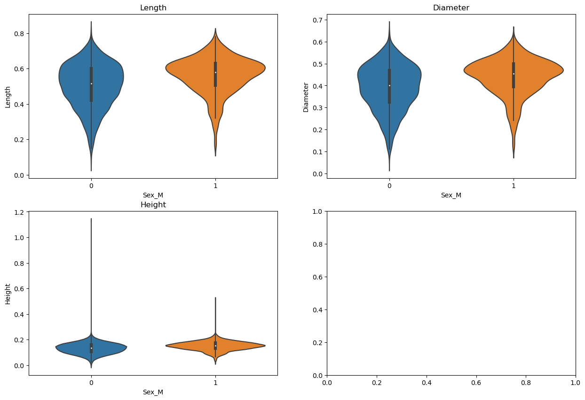
    


```python
from sklearn.preprocessing import MinMaxScaler

scaler = MinMaxScaler()

scaler.fit(df1[['Rings']])
df1['Rings_min'] = scaler.transform(df1[['Rings']])

scaler.fit(df1[['years']])
df1['years_min'] = scaler.transform(df1[['years']])
```


```python
df1
```


<div>
<style scoped>
    .dataframe tbody tr th:only-of-type {
        vertical-align: middle;
    }

    .dataframe tbody tr th {
        vertical-align: top;
    }

    .dataframe thead th {
        text-align: right;
    }
</style>
<table border="1" class="dataframe">
  <thead>
    <tr style="text-align: right;">
      <th></th>
      <th>Length</th>
      <th>Diameter</th>
      <th>Height</th>
      <th>Whole weight</th>
      <th>Shucked weight</th>
      <th>Viscera weight</th>
      <th>Shell weight</th>
      <th>Rings</th>
      <th>Sex_F</th>
      <th>Sex_I</th>
      <th>Sex_M</th>
      <th>years</th>
      <th>Rings_min</th>
      <th>years_min</th>
    </tr>
  </thead>
  <tbody>
    <tr>
      <th>0</th>
      <td>0.455</td>
      <td>0.365</td>
      <td>0.095</td>
      <td>0.5140</td>
      <td>0.2245</td>
      <td>0.1010</td>
      <td>0.1500</td>
      <td>15</td>
      <td>0</td>
      <td>0</td>
      <td>1</td>
      <td>16.5</td>
      <td>0.500000</td>
      <td>0.500000</td>
    </tr>
    <tr>
      <th>1</th>
      <td>0.350</td>
      <td>0.265</td>
      <td>0.090</td>
      <td>0.2255</td>
      <td>0.0995</td>
      <td>0.0485</td>
      <td>0.0700</td>
      <td>7</td>
      <td>0</td>
      <td>0</td>
      <td>1</td>
      <td>8.5</td>
      <td>0.214286</td>
      <td>0.214286</td>
    </tr>
    <tr>
      <th>2</th>
      <td>0.530</td>
      <td>0.420</td>
      <td>0.135</td>
      <td>0.6770</td>
      <td>0.2565</td>
      <td>0.1415</td>
      <td>0.2100</td>
      <td>9</td>
      <td>1</td>
      <td>0</td>
      <td>0</td>
      <td>10.5</td>
      <td>0.285714</td>
      <td>0.285714</td>
    </tr>
    <tr>
      <th>3</th>
      <td>0.440</td>
      <td>0.365</td>
      <td>0.125</td>
      <td>0.5160</td>
      <td>0.2155</td>
      <td>0.1140</td>
      <td>0.1550</td>
      <td>10</td>
      <td>0</td>
      <td>0</td>
      <td>1</td>
      <td>11.5</td>
      <td>0.321429</td>
      <td>0.321429</td>
    </tr>
    <tr>
      <th>4</th>
      <td>0.330</td>
      <td>0.255</td>
      <td>0.080</td>
      <td>0.2050</td>
      <td>0.0895</td>
      <td>0.0395</td>
      <td>0.0550</td>
      <td>7</td>
      <td>0</td>
      <td>1</td>
      <td>0</td>
      <td>8.5</td>
      <td>0.214286</td>
      <td>0.214286</td>
    </tr>
    <tr>
      <th>...</th>
      <td>...</td>
      <td>...</td>
      <td>...</td>
      <td>...</td>
      <td>...</td>
      <td>...</td>
      <td>...</td>
      <td>...</td>
      <td>...</td>
      <td>...</td>
      <td>...</td>
      <td>...</td>
      <td>...</td>
      <td>...</td>
    </tr>
    <tr>
      <th>4172</th>
      <td>0.565</td>
      <td>0.450</td>
      <td>0.165</td>
      <td>0.8870</td>
      <td>0.3700</td>
      <td>0.2390</td>
      <td>0.2490</td>
      <td>11</td>
      <td>1</td>
      <td>0</td>
      <td>0</td>
      <td>12.5</td>
      <td>0.357143</td>
      <td>0.357143</td>
    </tr>
    <tr>
      <th>4173</th>
      <td>0.590</td>
      <td>0.440</td>
      <td>0.135</td>
      <td>0.9660</td>
      <td>0.4390</td>
      <td>0.2145</td>
      <td>0.2605</td>
      <td>10</td>
      <td>0</td>
      <td>0</td>
      <td>1</td>
      <td>11.5</td>
      <td>0.321429</td>
      <td>0.321429</td>
    </tr>
    <tr>
      <th>4174</th>
      <td>0.600</td>
      <td>0.475</td>
      <td>0.205</td>
      <td>1.1760</td>
      <td>0.5255</td>
      <td>0.2875</td>
      <td>0.3080</td>
      <td>9</td>
      <td>0</td>
      <td>0</td>
      <td>1</td>
      <td>10.5</td>
      <td>0.285714</td>
      <td>0.285714</td>
    </tr>
    <tr>
      <th>4175</th>
      <td>0.625</td>
      <td>0.485</td>
      <td>0.150</td>
      <td>1.0945</td>
      <td>0.5310</td>
      <td>0.2610</td>
      <td>0.2960</td>
      <td>10</td>
      <td>1</td>
      <td>0</td>
      <td>0</td>
      <td>11.5</td>
      <td>0.321429</td>
      <td>0.321429</td>
    </tr>
    <tr>
      <th>4176</th>
      <td>0.710</td>
      <td>0.555</td>
      <td>0.195</td>
      <td>1.9485</td>
      <td>0.9455</td>
      <td>0.3765</td>
      <td>0.4950</td>
      <td>12</td>
      <td>0</td>
      <td>0</td>
      <td>1</td>
      <td>13.5</td>
      <td>0.392857</td>
      <td>0.392857</td>
    </tr>
  </tbody>
</table>
<p>4177 rows × 14 columns</p>
</div>


```python
figure, axes = plt.subplots(1, 1, figsize=(15,10))
axes.set_title('Length')
sns.scatterplot(ax=axes, data=df1, x='Length', y='years_min')
```


    <AxesSubplot:title={'center':'Length'}, xlabel='Length', ylabel='years_min'>


    
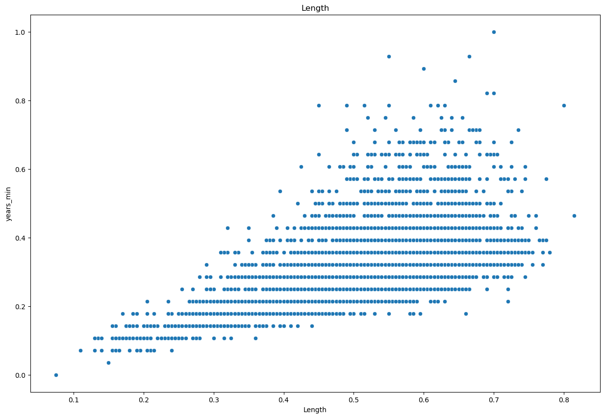
    


```python
df1.describe()
```


<div>
<style scoped>
    .dataframe tbody tr th:only-of-type {
        vertical-align: middle;
    }

    .dataframe tbody tr th {
        vertical-align: top;
    }

    .dataframe thead th {
        text-align: right;
    }
</style>
<table border="1" class="dataframe">
  <thead>
    <tr style="text-align: right;">
      <th></th>
      <th>Length</th>
      <th>Diameter</th>
      <th>Height</th>
      <th>Whole weight</th>
      <th>Shucked weight</th>
      <th>Viscera weight</th>
      <th>Shell weight</th>
      <th>Rings</th>
      <th>Sex_F</th>
      <th>Sex_I</th>
      <th>Sex_M</th>
      <th>years</th>
      <th>Rings_min</th>
      <th>years_min</th>
    </tr>
  </thead>
  <tbody>
    <tr>
      <th>count</th>
      <td>4177.000000</td>
      <td>4177.000000</td>
      <td>4177.000000</td>
      <td>4177.000000</td>
      <td>4177.000000</td>
      <td>4177.000000</td>
      <td>4177.000000</td>
      <td>4177.000000</td>
      <td>4177.000000</td>
      <td>4177.000000</td>
      <td>4177.000000</td>
      <td>4177.000000</td>
      <td>4177.000000</td>
      <td>4177.000000</td>
    </tr>
    <tr>
      <th>mean</th>
      <td>0.523992</td>
      <td>0.407881</td>
      <td>0.139516</td>
      <td>0.828742</td>
      <td>0.359367</td>
      <td>0.180594</td>
      <td>0.238831</td>
      <td>9.933684</td>
      <td>0.312904</td>
      <td>0.321283</td>
      <td>0.365813</td>
      <td>11.433684</td>
      <td>0.319060</td>
      <td>0.319060</td>
    </tr>
    <tr>
      <th>std</th>
      <td>0.120093</td>
      <td>0.099240</td>
      <td>0.041827</td>
      <td>0.490389</td>
      <td>0.221963</td>
      <td>0.109614</td>
      <td>0.139203</td>
      <td>3.224169</td>
      <td>0.463731</td>
      <td>0.467025</td>
      <td>0.481715</td>
      <td>3.224169</td>
      <td>0.115149</td>
      <td>0.115149</td>
    </tr>
    <tr>
      <th>min</th>
      <td>0.075000</td>
      <td>0.055000</td>
      <td>0.000000</td>
      <td>0.002000</td>
      <td>0.001000</td>
      <td>0.000500</td>
      <td>0.001500</td>
      <td>1.000000</td>
      <td>0.000000</td>
      <td>0.000000</td>
      <td>0.000000</td>
      <td>2.500000</td>
      <td>0.000000</td>
      <td>0.000000</td>
    </tr>
    <tr>
      <th>25%</th>
      <td>0.450000</td>
      <td>0.350000</td>
      <td>0.115000</td>
      <td>0.441500</td>
      <td>0.186000</td>
      <td>0.093500</td>
      <td>0.130000</td>
      <td>8.000000</td>
      <td>0.000000</td>
      <td>0.000000</td>
      <td>0.000000</td>
      <td>9.500000</td>
      <td>0.250000</td>
      <td>0.250000</td>
    </tr>
    <tr>
      <th>50%</th>
      <td>0.545000</td>
      <td>0.425000</td>
      <td>0.140000</td>
      <td>0.799500</td>
      <td>0.336000</td>
      <td>0.171000</td>
      <td>0.234000</td>
      <td>9.000000</td>
      <td>0.000000</td>
      <td>0.000000</td>
      <td>0.000000</td>
      <td>10.500000</td>
      <td>0.285714</td>
      <td>0.285714</td>
    </tr>
    <tr>
      <th>75%</th>
      <td>0.615000</td>
      <td>0.480000</td>
      <td>0.165000</td>
      <td>1.153000</td>
      <td>0.502000</td>
      <td>0.253000</td>
      <td>0.329000</td>
      <td>11.000000</td>
      <td>1.000000</td>
      <td>1.000000</td>
      <td>1.000000</td>
      <td>12.500000</td>
      <td>0.357143</td>
      <td>0.357143</td>
    </tr>
    <tr>
      <th>max</th>
      <td>0.815000</td>
      <td>0.650000</td>
      <td>1.130000</td>
      <td>2.825500</td>
      <td>1.488000</td>
      <td>0.760000</td>
      <td>1.005000</td>
      <td>29.000000</td>
      <td>1.000000</td>
      <td>1.000000</td>
      <td>1.000000</td>
      <td>30.500000</td>
      <td>1.000000</td>
      <td>1.000000</td>
    </tr>
  </tbody>
</table>
</div>


```python
df2 = df1[df1['Height']<1]
```


```python
df2 = df2[df2['Shell weight']<1]
```


```python
df2 = df2[df2['Shucked weight']<1]
```


```python
df2
```


<div>
<style scoped>
    .dataframe tbody tr th:only-of-type {
        vertical-align: middle;
    }

    .dataframe tbody tr th {
        vertical-align: top;
    }

    .dataframe thead th {
        text-align: right;
    }
</style>
<table border="1" class="dataframe">
  <thead>
    <tr style="text-align: right;">
      <th></th>
      <th>Length</th>
      <th>Diameter</th>
      <th>Height</th>
      <th>Whole weight</th>
      <th>Shucked weight</th>
      <th>Viscera weight</th>
      <th>Shell weight</th>
      <th>Rings</th>
      <th>Sex_F</th>
      <th>Sex_I</th>
      <th>Sex_M</th>
      <th>years</th>
      <th>Rings_min</th>
      <th>years_min</th>
    </tr>
  </thead>
  <tbody>
    <tr>
      <th>0</th>
      <td>0.455</td>
      <td>0.365</td>
      <td>0.095</td>
      <td>0.5140</td>
      <td>0.2245</td>
      <td>0.1010</td>
      <td>0.1500</td>
      <td>15</td>
      <td>0</td>
      <td>0</td>
      <td>1</td>
      <td>16.5</td>
      <td>0.500000</td>
      <td>0.500000</td>
    </tr>
    <tr>
      <th>1</th>
      <td>0.350</td>
      <td>0.265</td>
      <td>0.090</td>
      <td>0.2255</td>
      <td>0.0995</td>
      <td>0.0485</td>
      <td>0.0700</td>
      <td>7</td>
      <td>0</td>
      <td>0</td>
      <td>1</td>
      <td>8.5</td>
      <td>0.214286</td>
      <td>0.214286</td>
    </tr>
    <tr>
      <th>2</th>
      <td>0.530</td>
      <td>0.420</td>
      <td>0.135</td>
      <td>0.6770</td>
      <td>0.2565</td>
      <td>0.1415</td>
      <td>0.2100</td>
      <td>9</td>
      <td>1</td>
      <td>0</td>
      <td>0</td>
      <td>10.5</td>
      <td>0.285714</td>
      <td>0.285714</td>
    </tr>
    <tr>
      <th>3</th>
      <td>0.440</td>
      <td>0.365</td>
      <td>0.125</td>
      <td>0.5160</td>
      <td>0.2155</td>
      <td>0.1140</td>
      <td>0.1550</td>
      <td>10</td>
      <td>0</td>
      <td>0</td>
      <td>1</td>
      <td>11.5</td>
      <td>0.321429</td>
      <td>0.321429</td>
    </tr>
    <tr>
      <th>4</th>
      <td>0.330</td>
      <td>0.255</td>
      <td>0.080</td>
      <td>0.2050</td>
      <td>0.0895</td>
      <td>0.0395</td>
      <td>0.0550</td>
      <td>7</td>
      <td>0</td>
      <td>1</td>
      <td>0</td>
      <td>8.5</td>
      <td>0.214286</td>
      <td>0.214286</td>
    </tr>
    <tr>
      <th>...</th>
      <td>...</td>
      <td>...</td>
      <td>...</td>
      <td>...</td>
      <td>...</td>
      <td>...</td>
      <td>...</td>
      <td>...</td>
      <td>...</td>
      <td>...</td>
      <td>...</td>
      <td>...</td>
      <td>...</td>
      <td>...</td>
    </tr>
    <tr>
      <th>4172</th>
      <td>0.565</td>
      <td>0.450</td>
      <td>0.165</td>
      <td>0.8870</td>
      <td>0.3700</td>
      <td>0.2390</td>
      <td>0.2490</td>
      <td>11</td>
      <td>1</td>
      <td>0</td>
      <td>0</td>
      <td>12.5</td>
      <td>0.357143</td>
      <td>0.357143</td>
    </tr>
    <tr>
      <th>4173</th>
      <td>0.590</td>
      <td>0.440</td>
      <td>0.135</td>
      <td>0.9660</td>
      <td>0.4390</td>
      <td>0.2145</td>
      <td>0.2605</td>
      <td>10</td>
      <td>0</td>
      <td>0</td>
      <td>1</td>
      <td>11.5</td>
      <td>0.321429</td>
      <td>0.321429</td>
    </tr>
    <tr>
      <th>4174</th>
      <td>0.600</td>
      <td>0.475</td>
      <td>0.205</td>
      <td>1.1760</td>
      <td>0.5255</td>
      <td>0.2875</td>
      <td>0.3080</td>
      <td>9</td>
      <td>0</td>
      <td>0</td>
      <td>1</td>
      <td>10.5</td>
      <td>0.285714</td>
      <td>0.285714</td>
    </tr>
    <tr>
      <th>4175</th>
      <td>0.625</td>
      <td>0.485</td>
      <td>0.150</td>
      <td>1.0945</td>
      <td>0.5310</td>
      <td>0.2610</td>
      <td>0.2960</td>
      <td>10</td>
      <td>1</td>
      <td>0</td>
      <td>0</td>
      <td>11.5</td>
      <td>0.321429</td>
      <td>0.321429</td>
    </tr>
    <tr>
      <th>4176</th>
      <td>0.710</td>
      <td>0.555</td>
      <td>0.195</td>
      <td>1.9485</td>
      <td>0.9455</td>
      <td>0.3765</td>
      <td>0.4950</td>
      <td>12</td>
      <td>0</td>
      <td>0</td>
      <td>1</td>
      <td>13.5</td>
      <td>0.392857</td>
      <td>0.392857</td>
    </tr>
  </tbody>
</table>
<p>4133 rows × 14 columns</p>
</div>


```python
df3 = df2[df2['Whole weight']<2.3]
```


```python
figure, axes = plt.subplots(1, 1, figsize=(10,5))
axes.set_title('Rings')
sns.histplot(ax=axes, data=df3, x='Rings')
```


    <AxesSubplot:title={'center':'Rings'}, xlabel='Rings', ylabel='Count'>


    
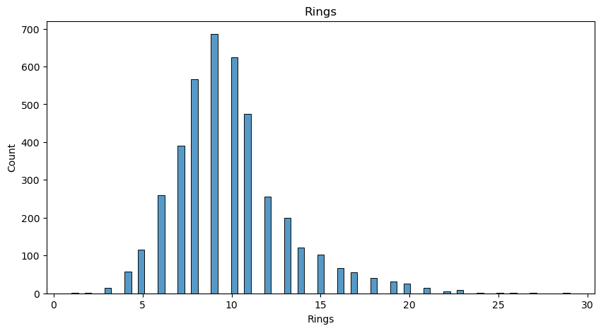
    


```python

```


```python

```


```python
X = df3.drop(['Rings','Sex_I','years','Rings_min','years_min'],axis='columns')
y = df3['years']
from sklearn.model_selection import train_test_split
poly = PolynomialFeatures(degree=2, include_bias=False)
poly_features = poly.fit_transform(X)
X_train, X_test, y_train, y_test = train_test_split(poly_features, y, test_size=0.2, random_state=42)

poly_reg_model = LinearRegression()
poly_reg_model.fit(X_train, y_train)

poly_reg_y_predicted = poly_reg_model.predict(X_test)
from sklearn.metrics import mean_squared_error
poly_reg_rmse = np.sqrt(mean_squared_error(y_test, poly_reg_y_predicted))
print('poly_reg_rmse is ' ,poly_reg_rmse)


```

    poly_reg_rmse is  2.0787797003816952
    


```python
poly_reg_model.score(X_test,y_test)
```


    0.5952616469672789


```python
poly_reg_model.score(X_train,y_train)
```


    0.5915475908266694


```python
for i in range(1000):
    X = df3.drop(['Rings','Sex_I','years','Rings_min','years_min'],axis='columns')
    y = df3['years']
    from sklearn.model_selection import train_test_split
    poly = PolynomialFeatures(degree=2, include_bias=False)
    poly_features = poly.fit_transform(X)
    X_train, X_test, y_train, y_test = train_test_split(poly_features, y, test_size=0.2)

    poly_reg_model = LinearRegression()
    poly_reg_model.fit(X_train, y_train)

    poly_reg_y_predicted = poly_reg_model.predict(X_test)
    from sklearn.metrics import mean_squared_error
    poly_reg_rmse = np.sqrt(mean_squared_error(y_test, poly_reg_y_predicted))
    if 0.5<=poly_reg_rmse<=1.86 :
        X_train1 = X_train
        X_test1 = X_test
        y_train1 = y_train
        y_test1 = y_test
        print('poly_reg_rmse is ' ,poly_reg_rmse)
    
```

    poly_reg_rmse is  1.8537984155186276
    


```python
poly_reg_model.score(X_test1,y_test1)
```


    0.6279452274321523


```python
poly_reg_model.score(X_train1,y_train1)
```


    0.58467505876894

